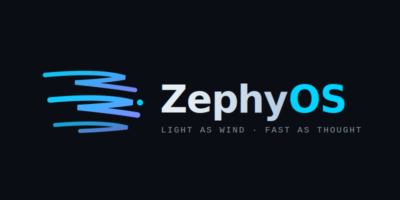

<div align="center">
  
  
  # ZephyOS
  **Light as wind. Fast as thought.**
  
  Distro Linux gaming berbasis CachyOS dengan emulator PlayStation built-in

  
  
  
</div>

---

## Tentang ZephyOS

ZephyOS adalah distribusi Linux gaming hasil remastering dari CachyOS,
dioptimalkan khusus untuk kebutuhan gaming dengan emulator PlayStation
built-in dan deteksi driver GPU otomatis.

Nama **Zephy** diambil dari **Zephyr** — dewa angin barat dalam mitologi
Yunani yang melambangkan dua karakteristik utama distro ini: ringan dan cepat.

---

## Fitur Utama

- Kernel `linux-cachyos` dengan BORE scheduler untuk latency rendah
- Auto-detect driver GPU (AMD/NVIDIA/Intel) tanpa konfigurasi manual
- Emulator PlayStation PS1, PS2, PS3, dan PSP sudah pre-installed
- Security layer aktif otomatis (UFW, AppArmor, ClamAV, Firejail)
- GUI installer Calamares — zero CLI untuk end user
- KDE Plasma (Wayland) — ringan, RAM idle di bawah 800MB
- Controller DualShock/DualSense otomatis terdeteksi
- Autologin sebagai `liveuser` di live session

---

## Spesifikasi

| Aspek | Nilai |
|-------|-------|
| Base OS | CachyOS (Arch-based) |
| Kernel | linux-cachyos (BORE scheduler) |
| Desktop | KDE Plasma (Wayland) |
| Display Manager | SDDM |
| Bootloader | GRUB |
| Installer | Calamares (GUI) |
| Target RAM idle | < 800 MB |

---

## Game Launchers

| Launcher | Platform | Keterangan |
|----------|----------|------------|
| Steam | PC/Steam | Platform game PC terbesar |
| Lutris | Universal | GOG, Epic, Battle.net, dll |
| Heroic Games Launcher | Epic/GOG | UI modern untuk Epic & GOG |
| Bottles | Windows Games | Jalankan game Windows via Wine |

---

## Emulator PlayStation

| Konsol | Emulator |
|--------|----------|
| PS1 | DuckStation |
| PS2 | PCSX2 |
| PS3 | RPCS3 |
| PSP | PPSSPP |

> File BIOS tidak disertakan. Lihat `README_BIOS_Emulator.txt` di desktop setelah install.

---

## Branding

### Warna
| Nama | Hex |
|------|-----|
| Wind Cyan | `#00D4FF` |
| Sky Violet | `#7B8CFF` |
| Deep Space | `#0A0E14` |

### Tagline
> Light as wind. Fast as thought.

### Logo
Logo ZephyOS terdiri dari **wind mark** — tiga garis mengalir yang
membentuk huruf Z, melambangkan aliran data dan frame rate yang mulus.

---

## Build dari Source

### Kebutuhan
- OS: CachyOS atau Arch Linux
- RAM: minimum 8GB
- Disk: minimum 60GB free
- Internet stabil

### Cara Build Manual

```bash
git clone https://github.com/Alfz-syu/zephyos.git
cd zephyos
sudo mkarchiso -v \
    -w /home/$USER/zephyos-work \
    -o output/ \
    releng/
```

ISO akan tersimpan di folder `output/`.

---

## Struktur Direktori

```
zephyos/
├── README.md
├── assets/
│   └── zephyos-logo.png
├── releng/                          
│   ├── packages.x86_64             
│   ├── profiledef.sh               
│   ├── pacman.conf                 
│   └── airootfs/
│       ├── usr/local/bin/
│       │   ├── detect-gpu-driver.sh
│       │   └── post-install-gpu.sh
│       ├── etc/
│       │   ├── systemd/system/
│       │   │   ├── gpu-detect.service
│       │   │   └── display-manager.service
│       │   ├── sddm.conf.d/
│       │   │   └── autologin.conf
│       │   ├── skel/Desktop/
│       │   │   ├── install-zephyos.desktop
│       │   │   └── README_BIOS_Emulator.txt
│       │   └── plymouth/
│       │       └── plymouthd.conf
│       └── usr/share/
│           ├── wallpapers/ZephyOS/
│           └── plymouth/themes/zephyos/
└── output/                        
```

---

## Cara Install ke USB

Burn ISO ke USB dengan Rufus (Windows):
- Partition scheme: **GPT**
- Target system: **UEFI (non CSM)**
- Write mode: **DD Image mode**

Atau dengan Ventoy — copy ISO ke partisi Ventoy, selesai.

Atau dengan dd (Linux):
```bash
sudo dd if=output/zephyos-*.iso of=/dev/sdX bs=4M status=progress
```

---

## Konfigurasi VirtualBox

| Setting | Nilai |
|---------|-------|
| Type | Linux (Arch 64-bit) |
| RAM | 4096 MB minimum |
| EFI | Enable (wajib) |
| Disk | 30 GB |
| Storage Controller | SATA (bukan IDE) |
| Live CD/DVD | Centang |
| Graphics Controller | VMSVGA |
| Video Memory | 128 MB |

---

## Customization

Edit file di folder `releng/`:

- **Tambah paket** → edit `releng/packages.x86_64`
- **Edit script GPU** → edit `releng/airootfs/usr/local/bin/detect-gpu-driver.sh`
- **Ganti identitas ISO** → edit `releng/profiledef.sh`

Lalu build ulang dengan `sudo mkarchiso`.

---

## Credits

- **Base**: [CachyOS](https://cachyos.org/)
- **Build tool**: [archiso](https://gitlab.archlinux.org/archlinux/archiso)
- **Installer**: [Calamares](https://calamares.io/)

---

## License

GPL v3 — mengikuti lisensi base CachyOS
